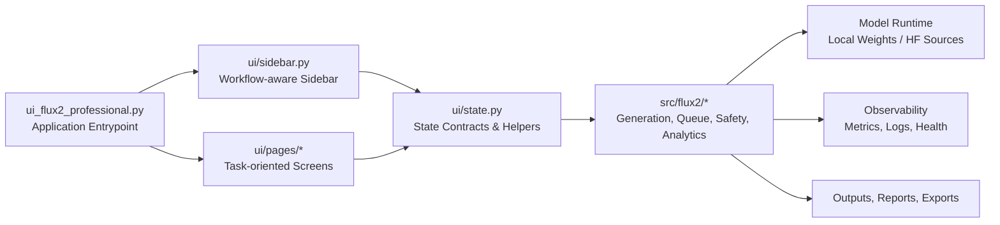
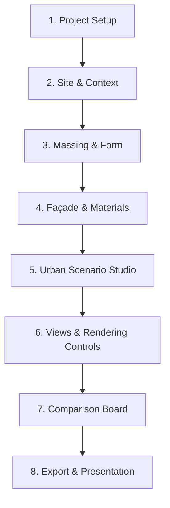
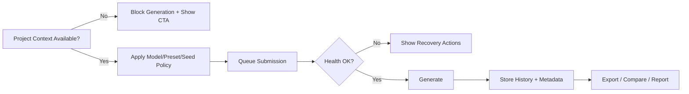

# FLUX.2 Architectural & Urban Studio

**An integrated computational design environment for architectural and urban exploration, structured to connect site intelligence, program intent, massing logic, façade articulation, and public-realm performance within a single, traceable visual workflow. The system operationalizes design intent through project-scoped metadata, parameterized generation controls, seed-consistent iteration, and scenario-based comparison so alternatives can be evaluated with greater reproducibility and analytical clarity.**


---

## Table of Contents

1. [Research & Product Context](#research--product-context)
2. [Objectives](#objectives)
3. [System Architecture](#system-architecture)
4. [Workflow Topology](#workflow-topology)
5. [Core Technical Modules](#core-technical-modules)
6. [Design Principles](#design-principles)
7. [Data & State Contract](#data--state-contract)
8. [Experimental and Benchmark Philosophy](#experimental-and-benchmark-philosophy)
9. [Quality Gates & Release Readiness](#quality-gates--release-readiness)
10. [Reproducibility Guide](#reproducibility-guide)
11. [Performance & SLO Model](#performance--slo-model)
12. [Quick Start](#quick-start)
13. [Configuration Profiles](#configuration-profiles)
14. [Security, Privacy, and Safe Publishing](#security-privacy-and-safe-publishing)
15. [Deployment and Operations](#deployment-and-operations)
16. [Risk Register & Mitigations](#risk-register--mitigations)
17. [Contributing Workflow](#contributing-workflow)
18. [Documentation Map](#documentation-map)
19. [Licensing](#licensing)

---

## Research & Product Context

Design teams often face a trade-off between **creative throughput** and **traceable decision quality**. This repository addresses that gap by combining:

- high-frequency generation loops,
- project-scoped context modeling,
- queue-driven operational control,
- and governance-ready export/report pathways.

The platform is explicitly designed for **iterative architectural reasoning** rather than single-shot image generation.

### Primary Use Cases

- Concept massing exploration under project constraints
- Façade and material variation with controlled parameter drift
- Scenario comparison and shortlist decision-making
- Export-ready visual packages for review and communication

---

## Objectives

### Functional Objectives

- Support text-to-image and reference-aware generation workflows.
- Keep guided workflow mode and legacy navigation mode interoperable.
- Surface operational state (queue, health, errors) without tab switching.

### Scientific/Engineering Objectives

- Improve reproducibility through deterministic parameter snapshots.
- Reduce state drift across reruns via centralized session-state contracts.
- Enable controlled experimentation (baseline, regression, release candidate suites).

### Operational Objectives

- Fail safely under partial context (missing project, missing reference image, queue sync errors).
- Maintain clear rollback/recovery pathways in UI actions.
- Preserve auditability through reports, telemetry hooks, and explicit state transitions.

### Non-Goals

- Not a generic chat-first AI interface.
- Not a backend-agnostic orchestration framework.
- Not a persistent multi-tenant SaaS control plane in current scope.

---

## System Architecture



### Architectural Principles

- **Separation of concerns**: UI orchestration in `ui/`, domain/runtime in `src/flux2/`.
- **State-first behavior**: side effects flow through explicit session-state keys.
- **Backward compatibility**: navigation and page contracts are preserved during refactors.

### Runtime Topology

```mermaid
flowchart TB
    SUBGRAPH_UI[User-Facing Layer]
        SB[Sidebar]
        PG[Pages]
    end
    SUBGRAPH_APP[Application Layer]
        ST[State Manager]
        QA[Quick Actions]
        EH[Error Handler]
    end
    SUBGRAPH_DOMAIN[Domain Services]
        Q[Queue Manager]
        S[Safety Pipeline]
        A[Analytics + KPI]
        G[Governance Artifacts]
    end
    SUBGRAPH_INFRA[Infra & IO]
        M[Model Files / HF]
        O[Outputs]
        OBS[Monitoring Stack]
    end

    SB --> ST
    PG --> ST
    ST --> QA
    ST --> EH
    ST --> Q
    ST --> S
    ST --> A
    ST --> G
    Q --> O
    S --> O
    A --> OBS
    G --> O
    ST --> M
```

---

## Workflow Topology



This workflow can be used in two compatible modes:

- **Architecture Workflow**: guided progression for structured project development.
- **Legacy Compatibility**: tab-oriented navigation preserving existing user habits.

### Decision Flow



---

## Core Technical Modules

### UI and Interaction Layer

- `ui/sidebar.py`: progressive disclosure, queue controls, quick actions, fallback UX.
- `ui/sidebar_quick_actions.py`: undo-like actions, session clearing, health checks.
- `ui/pages/*`: domain-specific interfaces (generator, editor, queue, progress, export).

### State and Consistency Layer

- `ui/state.py`: canonical defaults, model sync, preset application, project context access.
- Enforces key stability and predictable state transitions across reruns.

### Runtime and Services Layer

- `src/flux2/queue_manager.py`: queued generation lifecycle and status summaries.
- `src/flux2/safety_pipeline.py`, `nsfw_detector.py`: safety-oriented controls.
- `src/flux2/performance_metrics.py`, `baseline_kpi.py`: performance instrumentation.
- `src/flux2/report_generator.py`, governance modules: reporting and traceability support.

### Capability Matrix

| Capability | Guided Workflow | Legacy Mode | Notes |
| --- | ---: | ---: | --- |
| Project context gating | ✅ | ✅ | Prevents contextless generation |
| Queue controls | ✅ | ✅ | Auto-run, pause/resume, status |
| History restore | ✅ | ✅ | Snapshot-based parameter restore |
| Session quick actions | ✅ | ✅ | Clear transient data, undo-like actions |
| Health warnings | ✅ | ✅ | Disk, staleness, queue-failure indicators |

---

## Design Principles

1. **Deterministic by default**: every actionable state transition should be inspectable.
2. **Progressive disclosure**: show only relevant controls for current workflow stage.
3. **Failure transparency**: errors must be actionable and reversible where possible.
4. **Operational locality**: common recovery actions should be available near live status.
5. **Backward-safe evolution**: refactors must preserve expected page-level contracts.

---

## Data & State Contract

State design is contract-driven. Key families include:

- **Project context**: `projects`, `active_project_id`
- **Generation params**: `model_name`, `quality_preset`, `width`, `height`, `seed`, `use_random_seed`
- **Queue control**: `generation_queue`, `queue_auto_run`, `queue_paused`
- **History/session**: `generation_history`, `action_history`, transient output keys

### Transition Invariants

- A project must be active to fully enable generation controls.
- Queue controls must not desync with queue status panel.
- Restoring history must update model/seed/size coherently.
- Session clear must preserve durable project context.

---

## Experimental and Benchmark Philosophy

The repository includes benchmark utilities under `benchmarks/` intended for:

- baseline establishment,
- regression detection,
- release candidate quality gates.

### Recommended Evaluation Dimensions

- **Latency**: end-to-end generation time distribution (median, p95).
- **Stability**: queue processing reliability and recovery success rate.
- **Consistency**: parameter restoration correctness from history checkpoints.
- **Usability reliability**: no key collisions, no silent state failures.

### Experimental Rigor Suggestions

- Run controlled suites with fixed prompts and seed-policy definitions.
- Separate model variance from infrastructure variance.
- Track hardware profile metadata for every benchmark session.

### Suggested Evaluation Bundle

- Functional smoke suite (workflow, queue, editor, export)
- State transition suite (seed mode, model/preset, queue toggles)
- Backward-compatibility suite (legacy navigation, restore flows)
- Safety/fallback suite (missing context, disk pressure, sync failure)

---

## Quality Gates & Release Readiness

Promote releases using explicit gates:

| Gate | Condition | Outcome |
| --- | --- | --- |
| `G1` Build & boot | App starts without key collisions | Continue |
| `G2` Workflow parity | Guided and legacy modes behave consistently | Continue |
| `G3` State integrity | No silent failures in key transitions | Continue |
| `G4` Recovery UX | Fallbacks and retry paths validated | Continue |
| `G5` Documentation | QA report and known limitations updated | Release candidate |

Decision policy:

- **Safe to Release**: all gates pass
- **Needs Patch**: isolated gate issues with bounded blast radius
- **Hold Release**: multi-gate failures or data/state corruption risk

---

## Reproducibility Guide

### Determinism Checklist

- Pin Python and dependency versions.
- Define seed policy (`manual` vs `random`) explicitly.
- Record model key, preset, dimensions, and guidance/step values.
- Persist benchmark and report artifacts per run.

### Session Snapshot Strategy

Capture before/after snapshots at key transitions:

- project activation,
- queue start/pause/resume,
- history restore,
- session clear.

This supports drift detection and root-cause analysis for regressions.

### Reproducibility Metadata (Recommended)

- Commit SHA
- Python/package versions
- Model identifier + precision config
- Seed policy and value
- Hardware class and VRAM
- Queue mode + run timestamp

---

## Performance & SLO Model

Use service-level objectives to keep operations measurable:

- **Startup SLO**: clean app boot without sidebar exceptions
- **Queue Responsiveness SLO**: UI status reflects queue transitions near-real-time
- **State Consistency SLO**: rerun does not unexpectedly reset active controls
- **Recovery SLO**: retry/restore actions complete without manual state surgery

### KPI Suggestions

- Time-to-first-image
- Queue completion throughput
- Error-to-recovery time
- Restore success rate
- Session drift incidence

---

## Quick Start

### 1) Clone the repository

```bash
git clone https://github.com/mustafaras/flux2_architectural_urban_studio.git
cd flux2_architectural_urban_studio
```

### 2) Create and activate environment

```bash
python -m venv .venv
# Windows PowerShell
.venv\Scripts\Activate.ps1
pip install -e .
```

### 3) Start the application

```bash
streamlit run ui_flux2_professional.py
```

### 4) Optional: run benchmark harness

```bash
python benchmarks/run_all.py
```

---

## Configuration Profiles

Define and standardize environment profiles for predictable behavior:

- **Dev Profile**: fast iteration, local outputs, verbose logging
- **QA Profile**: deterministic seeds, stricter validation, report capture
- **Prod Profile**: guarded settings, monitoring enabled, recovery pathways visible

Recommended variables:

- `HF_TOKEN`
- `OPENROUTER_API_KEY`
- model path overrides when needed (`*_MODEL_PATH`, `AE_MODEL_PATH`)

---

## Model Download & Placement

This repository is intentionally shared **without model binaries**.  
After cloning, download model files and place them under the local `weights/` directory.

The UI now lists all supported FLUX.2 model variants. If a model file is missing, it appears as **(missing)** with guidance to download and copy the file.

### 1) Create required folders

```text
weights/
weights/text_encoder/
weights/text_encoder/Qwen--Qwen3-8B-FP8/
weights/text_encoder/Qwen--Qwen3-4B-FP8/
```

### 2) Place core FLUX model files

```text
weights/ae.safetensors
weights/flux-2-klein-4b.safetensors
weights/flux-2-klein-9b.safetensors
weights/flux-2-klein-base-4b.safetensors
weights/flux-2-klein-base-9b.safetensors
weights/flux2-dev.safetensors
```

When these files exist with these exact names, they are auto-detected in local-only mode (no extra environment variable required).

### 3) Place text encoder files

Download the full text encoder artifacts (config, tokenizer, vocab, merges, and model shard files) into:

```text
weights/text_encoder/Qwen--Qwen3-8B-FP8/
weights/text_encoder/Qwen--Qwen3-4B-FP8/
```

### 4) Optional: use explicit environment paths

If you keep models in a custom location, set environment variables instead of default local paths:

```text
AE_MODEL_PATH
KLEIN_4B_MODEL_PATH
KLEIN_4B_BASE_MODEL_PATH
KLEIN_9B_MODEL_PATH
KLEIN_9B_BASE_MODEL_PATH
FLUX2_MODEL_PATH
HF_TOKEN
```

### 5) Download sources (where to get models)

Download from Hugging Face and place files into the exact folders above:

- FLUX.2 Klein 4B: [Hugging Face - FLUX.2-klein-4B](https://huggingface.co/black-forest-labs/FLUX.2-klein-4B)  
    → copy `flux-2-klein-4b.safetensors` into `weights/`
- FLUX.2 Klein 9B: [Hugging Face - FLUX.2-klein-9B](https://huggingface.co/black-forest-labs/FLUX.2-klein-9B)  
    → copy `flux-2-klein-9b.safetensors` into `weights/`
- FLUX.2 Klein Base 4B: [Hugging Face - FLUX.2-klein-base-4B](https://huggingface.co/black-forest-labs/FLUX.2-klein-base-4B)  
    → copy `flux-2-klein-base-4b.safetensors` into `weights/`
- FLUX.2 Klein Base 9B: [Hugging Face - FLUX.2-klein-base-9B](https://huggingface.co/black-forest-labs/FLUX.2-klein-base-9B)  
    → copy `flux-2-klein-base-9b.safetensors` into `weights/`
- FLUX.2 Dev: [Hugging Face - FLUX.2-dev](https://huggingface.co/black-forest-labs/FLUX.2-dev)  
    → copy `flux2-dev.safetensors` into `weights/`
- FLUX AutoEncoder (`ae.safetensors`): included in the FLUX model repos above (or your approved internal model mirror)  
    → copy `ae.safetensors` into `weights/`
- Qwen text encoder (4B): [Hugging Face - Qwen3-4B-FP8](https://huggingface.co/Qwen/Qwen3-4B-FP8)  
    → download full repository files into `weights/text_encoder/Qwen--Qwen3-4B-FP8/`
- Qwen text encoder (8B): [Hugging Face - Qwen3-8B-FP8](https://huggingface.co/Qwen/Qwen3-8B-FP8)  
    → download full repository files into `weights/text_encoder/Qwen--Qwen3-8B-FP8/`

For gated/private model access, export `HF_TOKEN` before download.

---

## Security, Privacy, and Safe Publishing

- Store credentials only in environment variables (for example `HF_TOKEN`, `OPENROUTER_API_KEY`).
- Do not commit tokens, local secrets, or model binaries.
- Keep `.gitignore` protections active for `weights/`, token files, and local secrets.
- Validate publish safety with pre-push checks (`git status`, secret scan, tracked-file audit).

### Secure Release Checklist

- [ ] No token/secrets files tracked
- [ ] No model binaries tracked
- [ ] `.gitignore` rules validated with `git check-ignore`
- [ ] Root README/LICENSE present and unique
- [ ] Release notes and QA report updated

---

## Deployment and Operations

Native deployment is supported with service and observability assets in this repository:

- service definitions: `deployment/`
- infra configs: `config/` (Nginx, Prometheus, Grafana, Redis, RabbitMQ)
- scripts: `deploy.sh`, `deploy-windows.ps1`, `deploy-docker.sh`

```mermaid
flowchart LR
    APP[Streamlit Worker(s)] --> PROXY[Nginx / Reverse Proxy]
    APP --> QUEUE[Generation Queue]
    APP --> LOGS[Logs + Error Reports]
    LOGS --> OBS[Prometheus + Grafana]
```

### Operational Recommendations

- Run multiple workers behind a reverse proxy for resilience.
- Keep queue and monitoring on the same operational dashboard.
- Use structured logs for crash and regression triage.
- Preserve report artifacts per release candidate.

---

## Risk Register & Mitigations

| Risk | Impact | Mitigation |
| --- | --- | --- |
| Session-state drift | Parameter inconsistency | Snapshot checks + key-contract discipline |
| Queue sync degradation | Wrong operational decisions | Cached fallback + retry UX |
| Missing project context | Invalid generations | Hard gating + explanatory CTA |
| Large binary leakage in git | Repo bloat/security | Ignore policy + pre-push audits |
| Undocumented behavior changes | Team friction | Phase docs + compatibility reports |

---

## Contributing Workflow

1. Branch by scope (`feature/*`, `fix/*`, `qa/*`)
2. Keep PRs phase-sized and backward-safe
3. Run smoke + targeted checks before merge
4. Update docs/reports for behavior changes
5. Merge only after gate criteria are met

---

## Documentation Map

- [Deployment Guide](docs/DEPLOYMENT.md)
- [Performance Notes](docs/PERFORMANCE.md)
- [Error Handling](docs/ERROR_HANDLING.md)
- [Sidebar Redesign Specification](docs/SIDEBAR_REDESIGN_DETAILED.md)
- [Phase Reports](docs/reports/)

---

## Licensing

- Project source code: [Apache 2.0](LICENSE.md)
- Model-specific license terms (where applicable): `model_licenses/`

